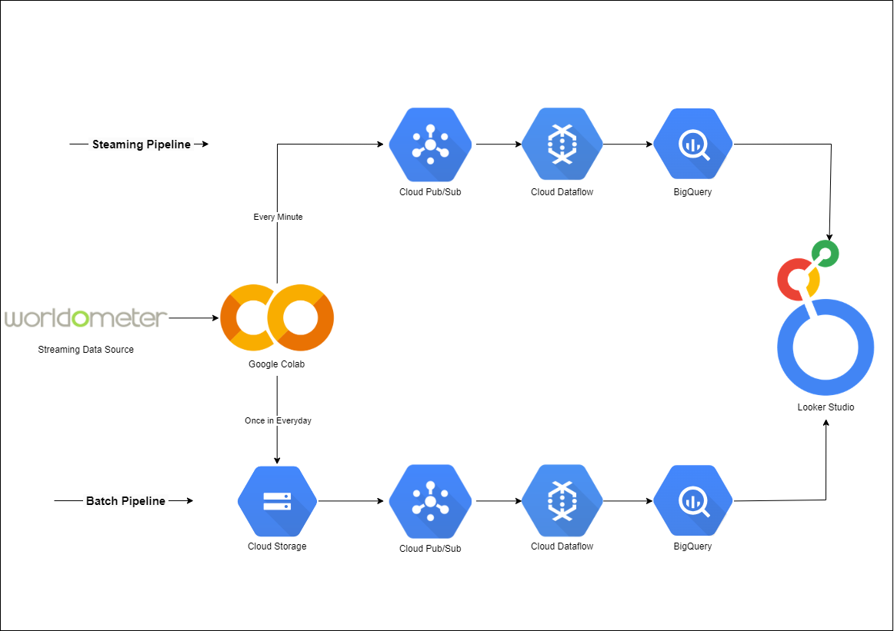
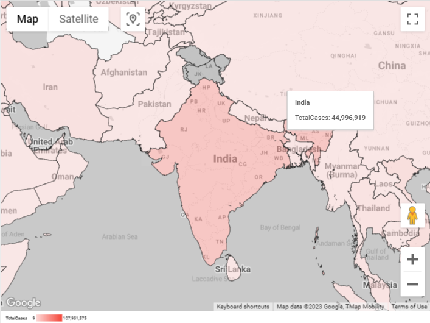
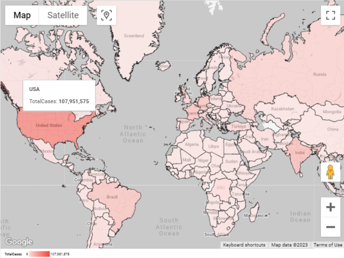

# Dataflow Data Pipeline Project

Welcome to my Dataflow Data Pipeline project! 🌐📊 This project aims to capture, process, and visualize COVID-19 data in both real-time and batch modes, offering insights into the evolving pandemic landscape.

## Streaming Pipeline

### Data Extraction
Live COVID-19 data is systematically extracted from the Worldometer website at one-minute intervals, ensuring a continuous and up-to-date stream of information.

### Data Publishing
The extracted data is instantly published to Google Cloud Pub/Sub using Google Colab, enabling seamless and real-time data distribution.

### DataFlow Streaming Pipeline
Leveraging the capabilities of Google Dataflow, a dedicated streaming pipeline is established to efficiently ingest, process, and transform the data from Pub/Sub. This ensures optimal real-time data management.

### Warehousing and Real-Time Visualization
Processed data finds its home in Google BigQuery, offering efficient storage and real-time querying capabilities. The power of Looker Studio comes into play, providing interactive dashboards for dynamic insights into the ever-changing COVID-19 metrics.

Through this streaming pipeline, the project enables continuous data acquisition, processing, and visualization, fostering real-time monitoring and informed analysis.

## Batch Pipeline

### Data Extraction
Daily snapshots of live COVID-19 data are captured from the Worldometer website, creating a comprehensive dataset reflecting daily pandemic statistics.

### Data Organization and Publishing
These snapshots are meticulously structured into CSV files and pushed to a designated Google Cloud Storage (GCS) bucket using Google Colab. The process triggers a Pub/Sub notification, marking the arrival of new insights.

### Crontab Scheduling
With the precision of Crontab scheduling, a daily task extracts the CSV filename from the Pub/Sub message, initiating seamless data transformation.

### DataFlow Batch Pipeline
Leveraging Dataflow's capabilities, a batch pipeline is established to process the data from CSV files. This includes essential transformations such as cleaning, normalization, and structuring, paving the way for in-depth analysis.

### Warehousing and Visualization
The transformed data resides in Google BigQuery, serving as a centralized repository for historical insights. Visualization is powered by Looker Studio, offering interactive dashboards that reveal the compelling story of COVID-19 trends over time.

 

By integrating both streaming and batch pipelines, this project provides a comprehensive approach to COVID-19 data management. From real-time monitoring to historical analysis, the dynamic perspectives offered are invaluable.

Stay tuned for updates as I continue to explore the data landscape! 🌟📈
